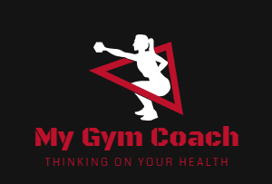

 
 

 
 

# <b>Introduction</b>

>This is a personal project so i can keep practicing some technologies/concepts that i'm learning.

This project aims to provide means for a gym coach to manage the training routines of an athlete by creating workout plans that are valid through a period of time. Each workout plan will contain all days of the week where each day can contain a set of exercises and informations on how to perform them.

On the future, the project will also support the management of the athlet's diet plans.

 
 

# <b>Project Goals</b>

I created this project mainly to practice a little of the technologies mentioned below:

- Spring Boot (webmvc)
- Spring JPA + Hibernate
- Java 11
- Keycloak
- Angular 10
- Typescript
- Docker + docker-compose
- Mockito
- Junit 5
- SQL
- PostgreSQL
- Postman API testing
- Creation of CI/CD pipeline

Another very important use for this project is to improve my knowlege on testing spring boot API's: unit, integration and automated tests.

 
 

# <b>Runnig this project</b>

`docker-compose up`

